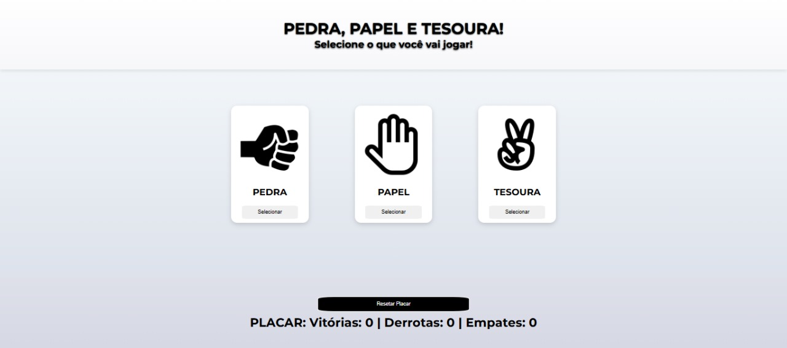

Jogo de Pedra, Papel e Tesoura

Este é um jogo interativo de Pedra, Papel e Tesoura implementado com HTML, CSS e JavaScript. O jogo permite que você desafie o computador e mantenha um placar das partidas.

Funcionalidades Principais
Escolha entre Pedra, Papel ou Tesoura:
Jogada automática do computador (aleatória), 
Sistema de pontuação com vitórias, derrotas e empates, 
Salvar placar usando localStorage (persistente), 
Botão para resetar o placar, 
Design responsivo para dispositivos móveis.

Tecnologias Utilizadas:
HTML5: Estrutura semântica do jogo

CSS3:
Flexbox para layout responsivo
Media queries para dispositivos móveis
Efeitos de hover e sombras
Fontes do Google (Montserrat)

JavaScript:
Manipulação DOM
Lógica do jogo
localStorage para persistência de dados
Geração de números aleatórios

Desenvolvido com ❤️ por Davi Teles de Moraes - Contribuições são bem-vindas!
